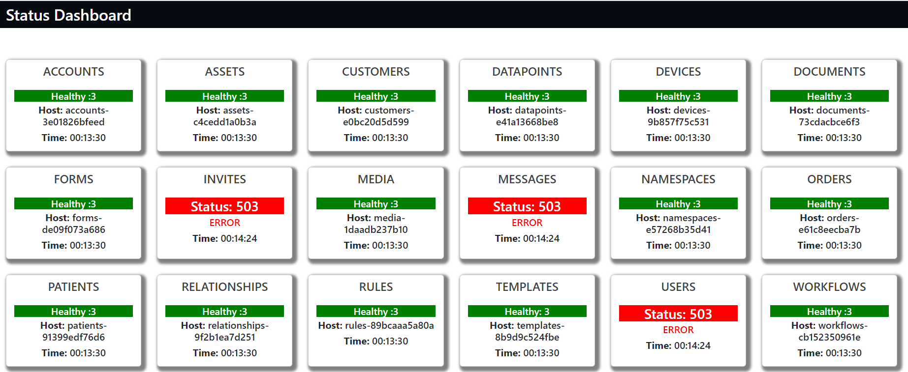

<a href="https://api-status-viewer.netlify.app/">
# <div align="center">📋 Factory Four API Dashboard App</div>


                             </a>
<p align="center">This is an APIs´ status dashboard app that allows you to check the conectivity status to the factoryFour API  </p>

## 🛠️ Technologies

<ul>
  <li><a href="https://reactjs.org/">React</a></li>
  <li><a href="https://skeleton-framework.github.io/">Node.Js</a></li>
  <li><a href="https://www.typescriptlang.org/">Typescript</a></li>
  <li><a href="https://react-bootstrap.github.io/">React Bootstrap</a></li>
</ul>

## ⚙️ Requirements

<ul>
  <li><a href="https://git-scm.com/">Git</a></li>
  <li><a href="https://nodejs.org/en/">Node.js</a></li>
  <li><a href="https://www.npmjs.com/">NPM</a></li>
</ul>

## 🚀 Installation

```
$ git clone https://github.com/cneme23/FactoryFourAPIs.git
$ cd FactoryFourAPIs/my-app
$ npm install
$ npm start
```

The application will open in the browser on http://localhost:3000
